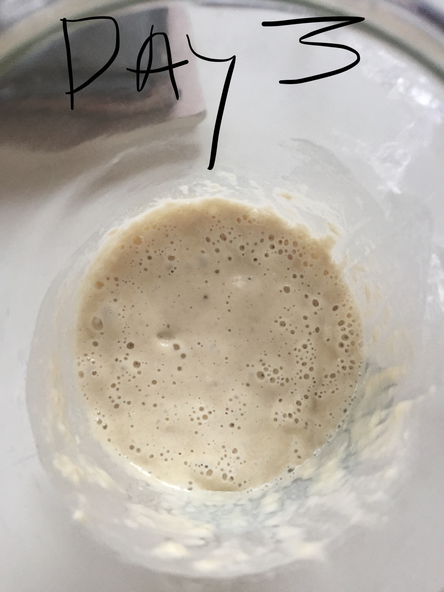
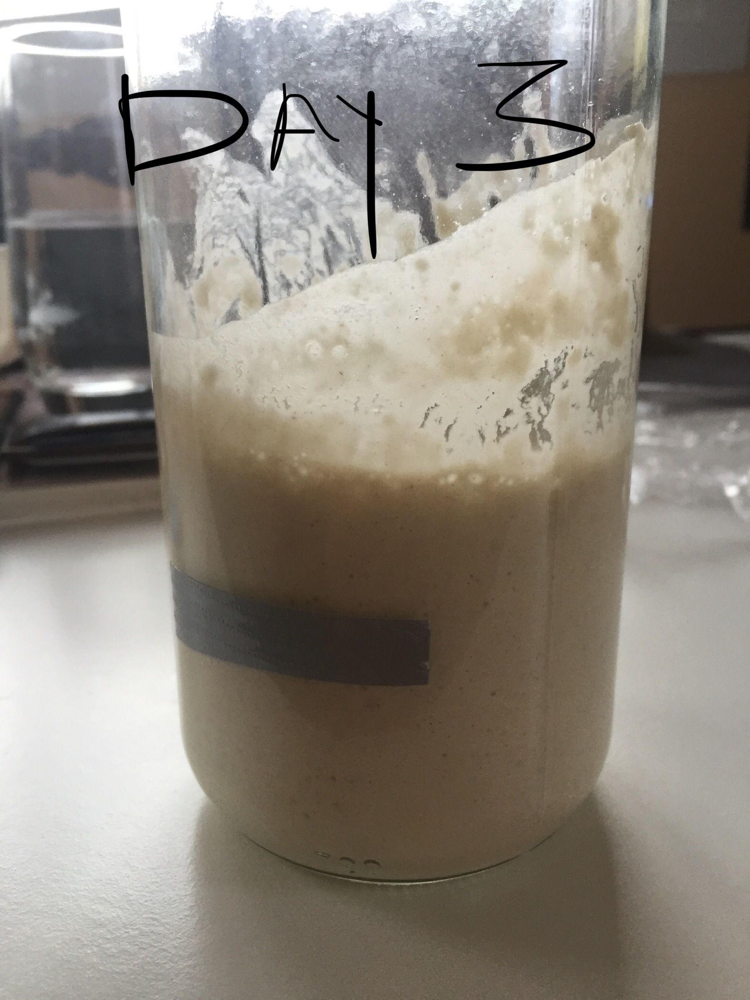
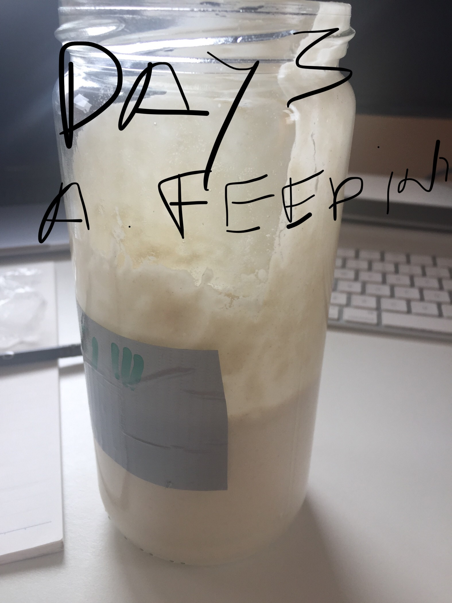
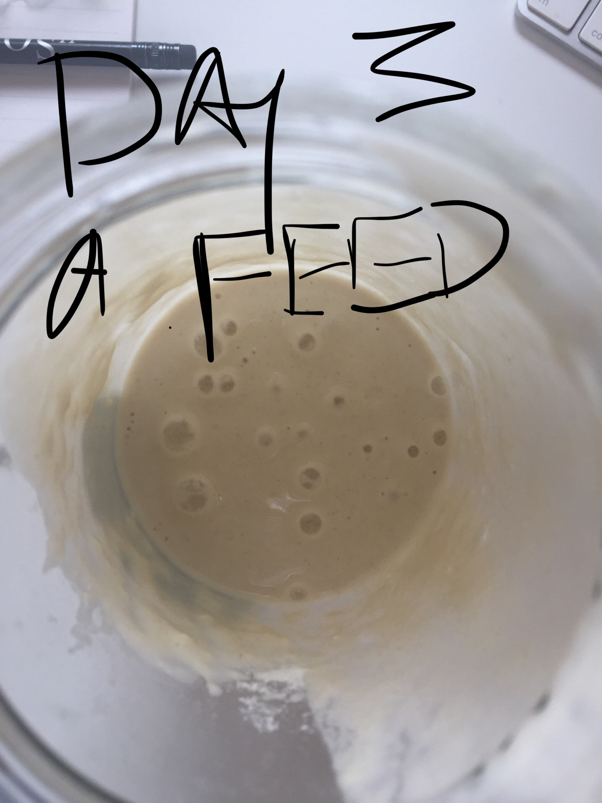
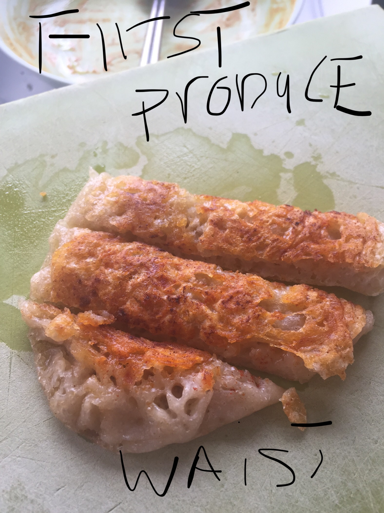
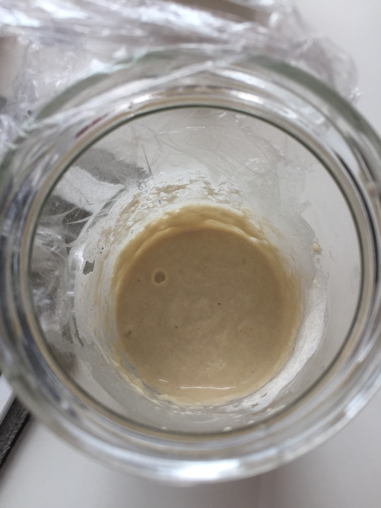
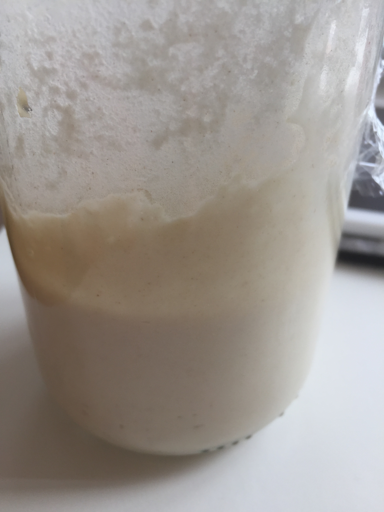
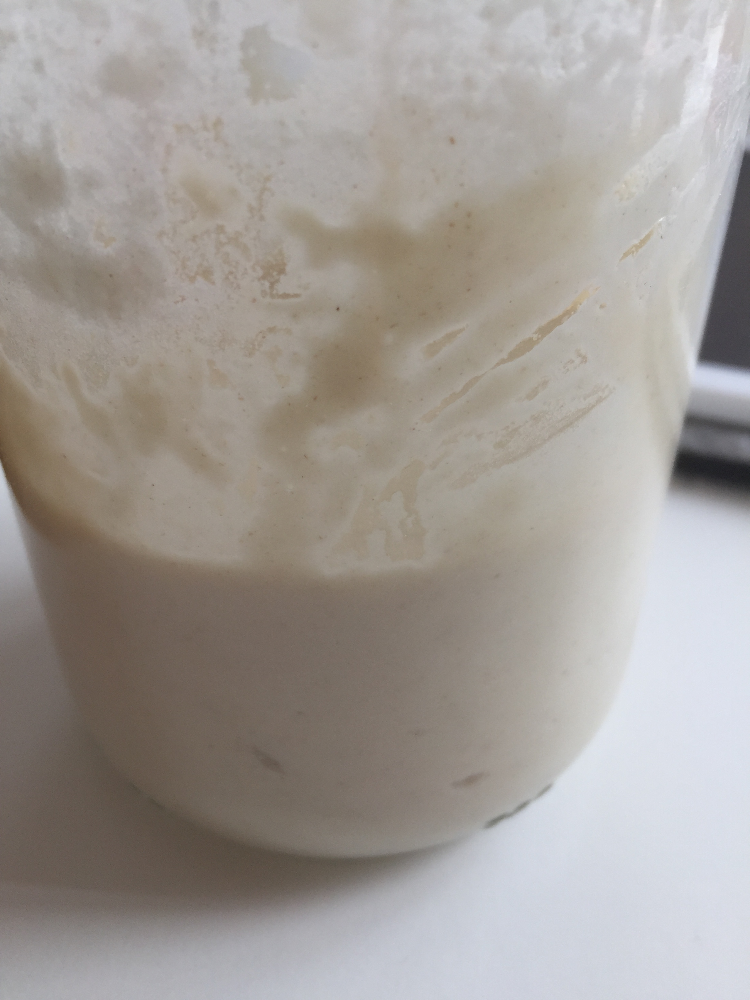

## Project Sourdough

## Batch 1

### Day 1
Update:

Activitu:  Put together the first flour and water.  50 grams of flower and 50 grams of water
### Day 2
Update: Not much activity - one or two bubbles ar the surface of the mix.  Did not take any pictures, will do better tomorrow.

Activity Added 50 grams of flour and 50 grams of water.

### Day 3

#### Before feeding
Update: Early morning and overnight the first evidence of a lot of activity.  About 50% volume increase (see sticker).

Pictures:

#### After feeding

Update: Dumped half the produce and fried it in a pan.  Added 50 grams of flour and 40 grams of water and then stirred everything up.

Pictures:

## Batch 2

### Day 1
Previous batch did not do much anymore - I think I made the mistake of putting too much water in.  It had a sour smell and there was not much bubbly activity at all.

Pictures:

